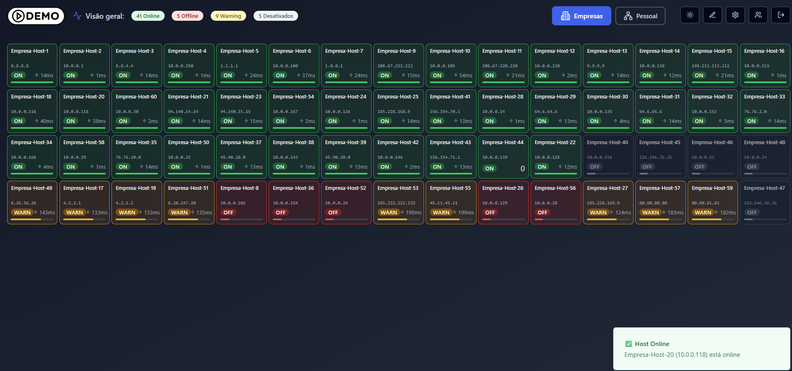
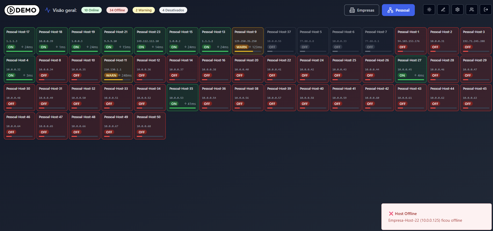
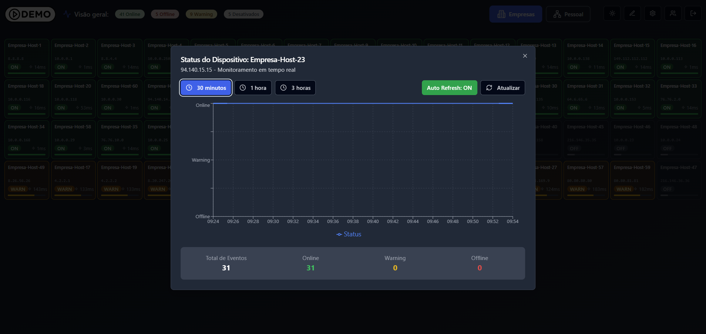
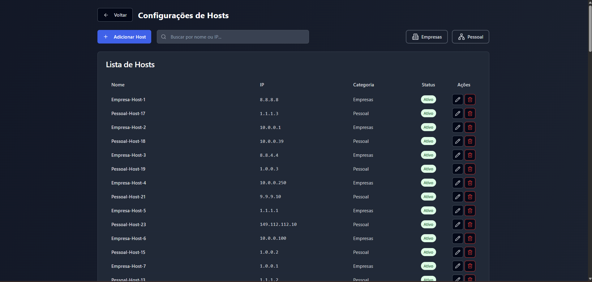
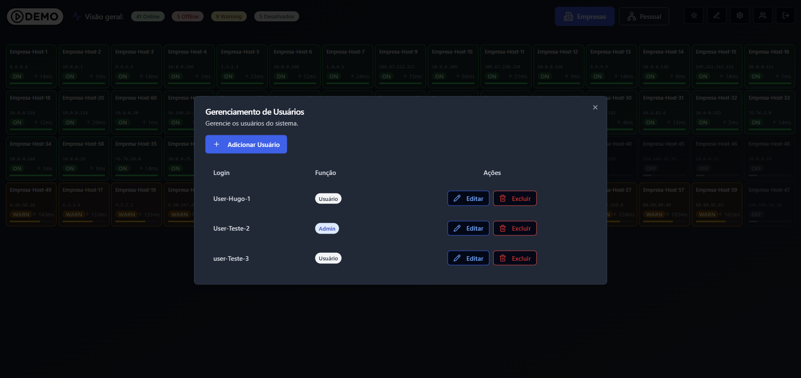
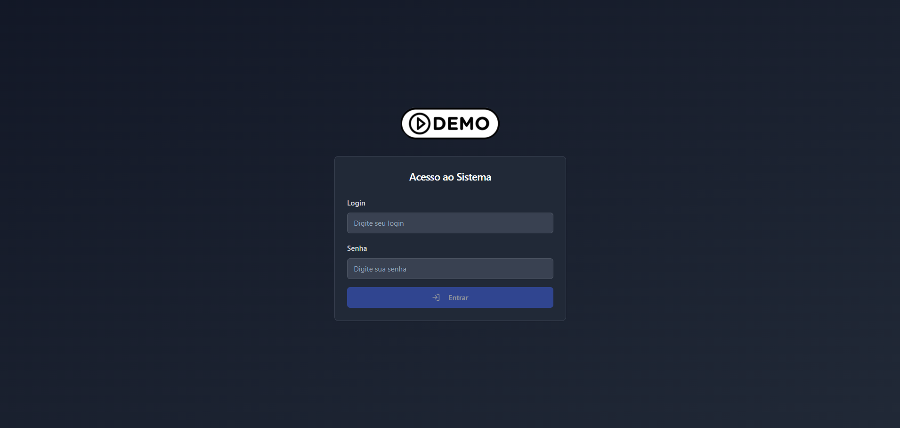

# 📚 Sistema de Monitoramento Ping

Sistema completo de monitoramento para dispositivos de rede com interface moderna e atualizações em tempo real.

## 🖼️ Preview do Sistema

| Dashboard Principal | Monitoramento em Tempo Real | Gráficos Interativos |
|:---:|:---:|:---:|
|  |  |  |

| Gerenciamento de Dispositivos | Gerenciamento de Usuários | Tela Inicial |
|:---:|:---:|:---:|
|  |  |  |

## Funcionalidades Principais

- **Monitoramento em Tempo Real** - Atualização a cada 1 segundo
- **Interface Drag & Drop** - Organize dispositivos como preferir
- **Notificações Inteligentes** - Alertas sonoros e visuais para mudanças de status
- **Gráficos Interativos** - Histórico de status com múltiplos períodos
- **Sistema de Autenticação** - Controle de acesso com diferentes níveis de permissão

## Tecnologias Utilizadas

**Frontend:** React, TypeScript, Tailwind CSS\
**Backend:** Python, MongoDB

## Destaques Técnicos

- Arquitetura frontend/backend separados
- Hooks customizados para gerenciamento de estado
- Interface responsiva com tema claro/escuro
- API RESTful

## Objetivo do Projeto

Desenvolver uma solução completa de monitoramento que demonstra habilidades em:
- Desenvolvimento full-stack
- Trabalho com APIs em tempo real
- UI/UX moderno e responsivo
- Gestão de estado complexo

---

### 📞 Contato

Se quiser adaptar essa solução para seu escritório, melhorar seu fluxo de trabalho ou até criar algo totalmente novo, entre em contato.

💼 [LinkedIn](https://linkedin.com/in/hugocarvalho-dev)

📩 **hugocarvalho1020@gmail.com**

---

*💡 Portifólio focado em demonstrar capacidades técnicas e de desenvolvimento*
